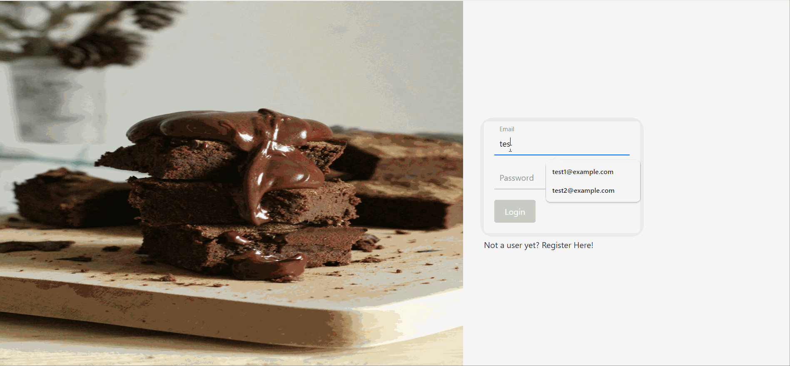
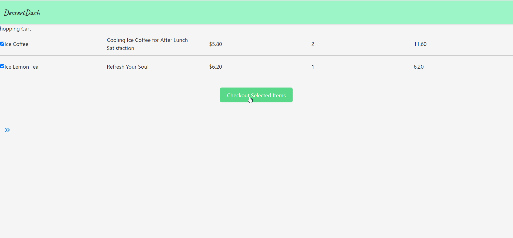

# DessertDash


Introducing our delightful dessert app, designed with a singular purpose: to satisfy the cravings of dessert enthusiasts everywhere! Our app seamlessly connects users with nearby dessert shops, ensuring that indulgence is always within reach.

With just a few clicks, users can explore a treasure trove of delectable treats and place orders for their favorites from the comfort of their own home. Whether it's a classic slice of cake, a decadent pastry, or a scoop of artisanal ice cream, our app has it all.

Say goodbye to dessert dilemmas and hello to sweet satisfaction. Join us today and embark on a journey to dessert bliss!

**Features of DessertDash:**

- Streamlines the ordering process 
- Users can order desserts online from their favourite shop, discover new dessert palours,
- Implemented User Location. (Next to implement the mechants location to search for nearby vendors)

# Screenshot

## User/customer Interface

#### Landing page for sign-ups and login



#### Search For Dessert Shops


#### Adding items to cart


#### CheckOut



## BuisnessOwner/Shop Interface

#### Shop product handling Interface


#### shop Order Handling Interface


# Technologies Used

-This app was built on PERN STACK

- React
- JSX
- CSS
- Node JS
- Material UI
- Bootstrap
- Postgre SQL
- PG
- expressJs


# Erd Diagram

##### ERD diagram based on the data needed to be stored on postgre sql


# Getting Started

### Backend Setup

1. Run `npm init -y` to initialize the project and create a package.json file
2. Run `npm i -D nodemon` to allow automatic restart for development purposes
3. Install all the packages and dependencies `npm i dotenv express express-validator pg jsonwebtoken bcrypt uuid cors helmet express-rate-limit`
4. Run `npm i pg` for allow the usage of the raw sql queries to communicate with database.
5. Create your .env file with the following variables:

```
PORT=5001
POSTGRESSQL_URI
ACCESS_SECRET=<YOUR_ACCESS_SECRET>
REFRESH_SECRET=<YOUR_REFRESH_SECRET>
DB_PASSWORD
```

### Frontend Setup

1. Run `npm i` to install all the dependencies
2. Run `npm i vite` to install vite
3. Run `npm i react-router-dom` to install react-router-dom
4. Run `npm i @mui/material @emotion/react @emotion/styled` to install Material UI
5. Run `npm i @mui/icons-material` to install Material UI icons
6. Run `npm i jwt-decode` to install jwt-decode
7. Create your .env file with the following variables:

```
VITE_SERVER=http://localhost:5001
VITE_SERVER_OPEN_MAP:http://www/openmap.gov.sg/
VITE_SERVER_OPEN_MAP_EMAIL: <email used for openmap acc>
VITE_SERVER_OPEN_MAP_PASSWORD: <password for openmap acc>
```


# Next Steps

- Improve on the GUI 
- Review Section for shops
- CSS touchups
- Like/Favourite feature + page which can serve as a reference or bookmark
- Include a buisness analasyis page
